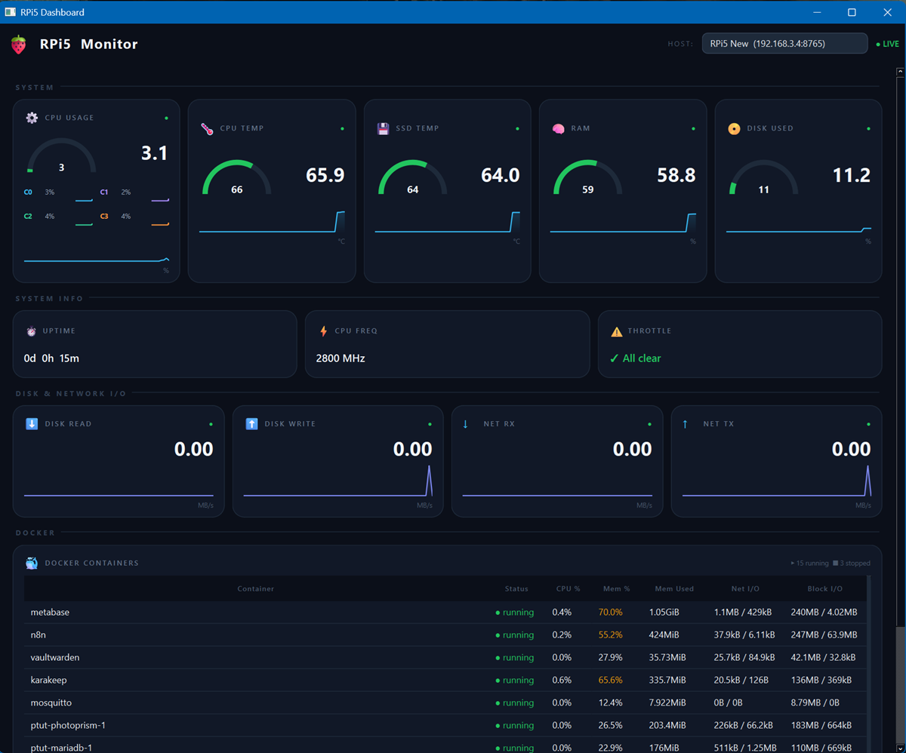

# 🍓 RPi5 Dashboard

A real-time system monitoring dashboard for Raspberry Pi 5 (and compatible SBCs). Consists of two components: a lightweight **metrics exporter** that runs on the Pi and exposes system stats over HTTP, and a **desktop dashboard** (Windows/Linux/macOS) built with PySide6 that visualises those metrics with live graphs, gauges, and a Docker container table.

<p align="left">
  
</p>

---

## Features

- **Live system metrics** — CPU usage (per-core bars), CPU temperature, SSD/NVMe temperature, RAM, disk usage, disk read/write throughput, network RX/TX
- **Arc gauges** with colour-coded thresholds (green → amber → red)
- **Sparkline history graphs** — 60-second rolling window per metric
- **Docker container table** — running/stopped status, CPU %, memory %, net I/O, block I/O
- **System info strip** — uptime, CPU frequency, throttle/undervoltage flags
- **Multi-host support** — switch between multiple Pis via a dropdown
- **Threshold alerts** — configurable warn/danger levels per metric in `config.json`
- **Non-blocking UI** — all HTTP fetches run in background threads; the UI never freezes
- **Auto-start on boot** via systemd

---

## Repository Structure

```
rpi5-dashboard/
├── rpi5_dashboard.py       # Desktop client (Windows/Linux/macOS)
├── metrics_exporter.py     # HTTP server — runs on the Raspberry Pi
├── config.json             # Client configuration
└── metrics_exporter.service  # systemd unit for the Pi
```

---

## Requirements

### Raspberry Pi (server)

| Dependency | Install |
|---|---|
| Python 3.9+ | pre-installed on Raspberry Pi OS |
| flask | `pip3 install flask` |
| psutil | `pip3 install psutil` |
| smartmontools | `sudo apt install smartmontools` |
| Docker (optional) | [docs.docker.com](https://docs.docker.com/engine/install/raspberry-pi-os/) |

### Desktop client (Windows/Linux/macOS)

| Dependency | Install |
|---|---|
| Python 3.10+ | [python.org](https://www.python.org/downloads/) |
| PySide6 | `pip install PySide6` |
| requests | `pip install requests` |

---

## Installation

### 1 — Metrics Exporter (Raspberry Pi)

```bash
# Clone or copy metrics_exporter.py to the Pi
mkdir -p /home/ptut/rpi-dashboard
cd /home/ptut/rpi-dashboard

# Install dependencies
pip3 install flask psutil

# Test run
python3 -u metrics_exporter.py
# → Running on http://0.0.0.0:8765
```

Verify it works from any machine on your network:

```bash
curl http://<pi-ip>:8765/metrics
```

---

### 2 — Auto-start on Boot (systemd)

```bash
# Copy the service file
sudo cp metrics_exporter.service /etc/systemd/system/

# Enable and start
sudo systemctl daemon-reload
sudo systemctl enable metrics_exporter
sudo systemctl start metrics_exporter

# Check status
sudo systemctl status metrics_exporter
```

Logs:

```bash
journalctl -u metrics_exporter -f
```

---

### 3 — Desktop Dashboard (Windows/Linux/macOS)

```bash
# Create and activate a virtual environment
python -m venv .venv

# Windows
.venv\Scripts\activate
# Linux / macOS
source .venv/bin/activate

# Install dependencies
pip install PySide6 requests

# Place config.json in the same directory as rpi5_dashboard.py
# Edit config.json to match your Pi's IP and port

# Run
python rpi5_dashboard.py
```

---

### 4 — Build a Standalone EXE (Windows, optional)

```bash
pip install pyinstaller

pyinstaller --onefile --windowed --icon=RPi.ico ^
  --paths=".venv\Lib\site-packages" ^
  --hidden-import=PySide6.QtCore ^
  --hidden-import=PySide6.QtWidgets ^
  --collect-all charset_normalizer ^
  --collect-all PySide6 ^
  rpi5_dashboard.py
```

The compiled binary is output to `dist/rpi5_dashboard.exe`. Place `config.json` in the same directory as the EXE before running.

---

## Configuration

`config.json` is placed alongside the dashboard executable or script.

```json
{
  "rpi": {
    "host": "192.168.99.3",
    "port": 8765,
    "refresh_seconds": 2
  },

  "hosts": [
    { "label": "RPi5 Main",   "host": "192.168.99.11", "port": 8765 },
    { "label": "RPi5 Dev",    "host": "192.168.99.12", "port": 8765 },
    { "label": "RPi4 Backup", "host": "192.168.99.13", "port": 8765 }
  ],

  "alerts": {
    "cpu_temp": 75,
    "ssd_temp": 75,
    "ram": 90
  }
}
```

| Key | Description |
|---|---|
| `rpi.host` / `rpi.port` | Primary host (used as fallback if `hosts` array is absent) |
| `rpi.refresh_seconds` | Poll interval in seconds |
| `hosts` | Array of hosts shown in the dropdown. Remove to use single-host mode. |
| `alerts.cpu_temp` | °C threshold — tile turns amber, gauge turns red above `+10` |
| `alerts.ssd_temp` | °C threshold for NVMe temperature |
| `alerts.ram` | % threshold for RAM usage |

---

## Metrics API

The exporter exposes a single endpoint:

```
GET http://<pi-ip>:8765/metrics
```

Example response:

```json
{
  "cpu": 6.2,
  "cpu_temp": 52.1,
  "cpu_freq_mhz": 2400,
  "cpu_cores": [8.0, 4.0, 6.0, 5.0],
  "ram": 41.3,
  "ssd_temp": 38,
  "disk_used": 22.5,
  "disk_read": 0.12,
  "disk_write": 0.04,
  "net_rx": 0.31,
  "net_tx": 0.08,
  "uptime": { "days": 3, "hours": 7, "minutes": 22, "total_seconds": 285742 },
  "throttle": {
    "raw": "0x0",
    "under_voltage_now": false,
    "throttled_now": false,
    "freq_capped_now": false,
    "soft_temp_limit_now": false,
    "under_voltage_ever": false,
    "throttled_ever": false
  },
  "docker": [
    {
      "name": "n8n",
      "status": "running",
      "cpu": 0.4,
      "mem_perc": 1.2,
      "mem_used": "94MiB",
      "mem_limit": "7.6GiB",
      "net_io": "1.2MB / 800kB",
      "block_io": "50MB / 12MB"
    }
  ]
}
```

---

## Troubleshooting

**`No connection could be made` / `Connection refused`**
The exporter is not running on the Pi. SSH in and check:
```bash
sudo systemctl status metrics_exporter
```

**`ModuleNotFoundError: No module named 'PySide6'`**
PyInstaller is running outside the venv. Use the full venv path:
```bash
.venv\Scripts\pyinstaller.exe ...
```
or ensure the venv is activated (`(.venv)` visible in the prompt).

**`ssd_temp` always null**
`smartctl` requires sudo. Either run the exporter as root (not recommended) or add a sudoers rule:
```bash
echo "ptut ALL=(ALL) NOPASSWD: /usr/bin/smartctl" | sudo tee /etc/sudoers.d/smartctl
```

**Docker stats not appearing**
The user running the exporter must be in the `docker` group:
```bash
sudo usermod -aG docker ptut
# Log out and back in for the change to take effect
```

---

## License

MIT
